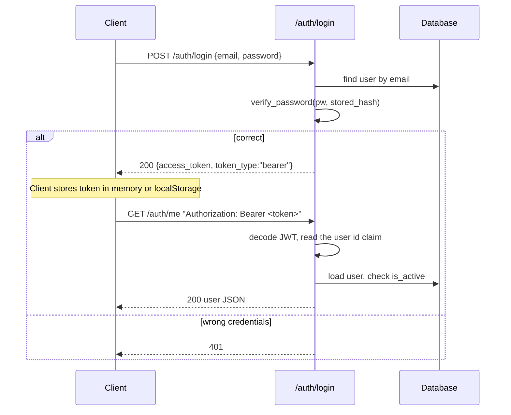

# Authentication

The `src/auth/` package provides a minimal user-management system over JWT bearer tokens. It is the reference implementation for the package pattern in [Project Structure](project_structure.md).

## Package layout

```
src/auth/
├── config.py        # AuthSetting: AUTH_SECRET_KEY, AUTH_ALGORITHM, AUTH_TOKEN_EXPIRE_MINUTES
├── models.py        # User table
├── schemas.py       # UserCreate, UserRead, UserUpdate, LoginRequest, TokenResponse
├── exceptions.py    # AuthError hierarchy
├── utils.py         # password hashing and JWT encode/decode, pure functions
├── service.py       # business logic over the User model
├── dependencies.py  # get_current_user and the bearer scheme
└── router.py        # /auth endpoints, rate-limited
```

The stateful part, models and service, is separated from the stateless helpers, JWT and hashing. This matches the package convention: business logic in `service.py`, pure helpers in `utils.py`.

## API surface

All routes live under the prefix `/auth` with the tag `Auth`. Everything except `/register` and `/login` requires the `Authorization: Bearer <token>` header.

| Method | Path             | Auth | Description                                  |
| ------ | ---------------- | ---- | -------------------------------------------- |
| POST   | `/auth/register` | no   | create a user, rate-limited                  |
| POST   | `/auth/login`    | no   | exchange credentials for a JWT, rate-limited |
| GET    | `/auth/me`       | yes  | return the authenticated user                |
| PATCH  | `/auth/me`       | yes  | update username or password                  |
| DELETE | `/auth/me`       | yes  | delete the account                           |

## The `User` model

```python
class User(Base):
    __tablename__ = "users"

    id = Column(Integer, primary_key=True, index=True)
    email = Column(String, unique=True, nullable=False)
    username = Column(String, unique=True, nullable=False)
    hashed_password = Column(String, nullable=False)
    is_active = Column(Boolean, default=True, nullable=False)
    created_at = Column(DateTime(timezone=True), server_default=func.now(), nullable=False)
    updated_at = Column(DateTime(timezone=True), server_default=func.now(), onupdate=func.now(), nullable=False)
```

* The login identity is `email`. It cannot change after creation, which is why `UserUpdate` has no email field.
* Emails are case-insensitive. They are trimmed and lowercased at the request boundary, so `User@Example.com` and `user@example.com` are the same account. Login works with any casing.
* Only `hashed_password` is stored, never the plaintext.
* The database enforces uniqueness on both `email` and `username`.

## Passwords

`src/auth/utils.py` hashes with PBKDF2-HMAC-SHA256, the OWASP-recommended 600,000 iterations, and a per-user random salt.

* `hash_password(password)` stores `"<salt>$<hex digest>"`.
* `verify_password(password, stored)` recomputes and compares with `hmac.compare_digest`, a constant-time comparison.

No `bcrypt` or `passlib` dependency is needed. To switch to argon2 or bcrypt later, change only `hash_password` and `verify_password`. Callers and storage stay the same: they see only the `"salt$digest"` string.

## JWT tokens

`utils.create_access_token(...)` builds an HS256-signed JWT:

* `sub` is the user id as a string, per the JWT spec.
* `iat` and `exp` come from `AUTH_TOKEN_EXPIRE_MINUTES`, which defaults to 60 minutes.
* It signs with `AUTH_SECRET_KEY` and `AUTH_ALGORITHM`, which defaults to `HS256`.

`utils.decode_access_token(...)` verifies the signature and `exp` and returns the payload. On any failure, expired, wrong key, or malformed, it raises `InvalidToken`.

`TokenResponse` is `{ "access_token": "...", "token_type": "bearer" }`.

## Login and use the token



## Protect an endpoint

`src/auth/dependencies.py` exposes the reusable guard:

```python
current_user_dependency = Annotated[User, Depends(get_current_user)]
```

Use it on any router:

```python
from src.auth.dependencies import current_user_dependency

@router.get("/me")
def get_me(current_user: current_user_dependency):
    return current_user
        # ^ the resolved User is injected
```

`get_current_user` does three things:

1. Reads the `Bearer` token with `HTTPBearer(auto_error=False)`, so a missing header raises our `InvalidToken`, not Starlette's default 403.
2. Calls `service.get_user_by_token()`, which decodes the JWT and loads the user.
3. Rejects inactive users through `is_active`.

This is the same dependency you import into your routers. The `todos` example only shows unauthenticated CRUD, so copy the auth route pattern into the package you extend.

## From other code and Swagger

Swagger UI at <http://localhost:8080/docs> shows an Authorize button for the bearer scheme. Paste the token there to fire authenticated requests from the UI.

The `login` endpoint takes a JSON body with `{email, password}`, not an OAuth2 form. See [Conventions](conventions.md).

### Example round-trip

```bash
TOKEN=$(curl -s -X POST http://localhost:8080/auth/login \
  -H 'Content-Type: application/json' \
  -d '{"email":"me@example.com","password":"supersecret123"}' | python3 -c 'import sys,json;print(json.load(sys.stdin)["access_token"])')

curl http://localhost:8080/auth/me -H "Authorization: Bearer $TOKEN"
```

## Validation and business rules

* `email` matches an email regex on both `register` and `login`.
* `username` is 1 to 32 characters.
* `password` is 8 to 128 characters on register and update.
* A duplicate `email` or `username` returns 409 Conflict.
* An unknown user or wrong password returns 401.
* A now-deleted or inactive user id in a still-valid token returns 403 or 404. The central mapping decides.

## Rate limiting

slowapi protects both public endpoints so `register` and `login` cannot be hammered. See [Core Cross-cutting Features](../developer-manual/core_crosscutting.md).

* `/auth/login` allows `5/minute`.
* `/auth/register` allows `3/minute`.

## Error mapping

Auth raises domain exceptions such as `InvalidCredentials`, `InvalidToken`, `UserAlreadyExists`, `InactiveUser`, and `UserNotFound`. `src/main.py` maps them centrally in one table. See [Health Checks & Error Handling](health_and_errors.md).

For adopters: rotate `AUTH_SECRET_KEY` in production, keep tokens short-lived, and add refresh tokens only if your UI needs long-lived sessions. The password hash never leaves the database. The `/me` endpoints hide `hashed_password` through `response_model=UserRead`.
